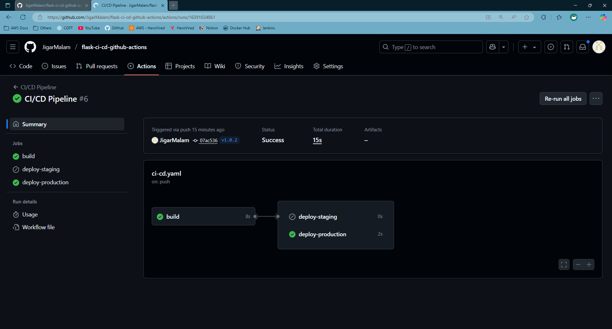
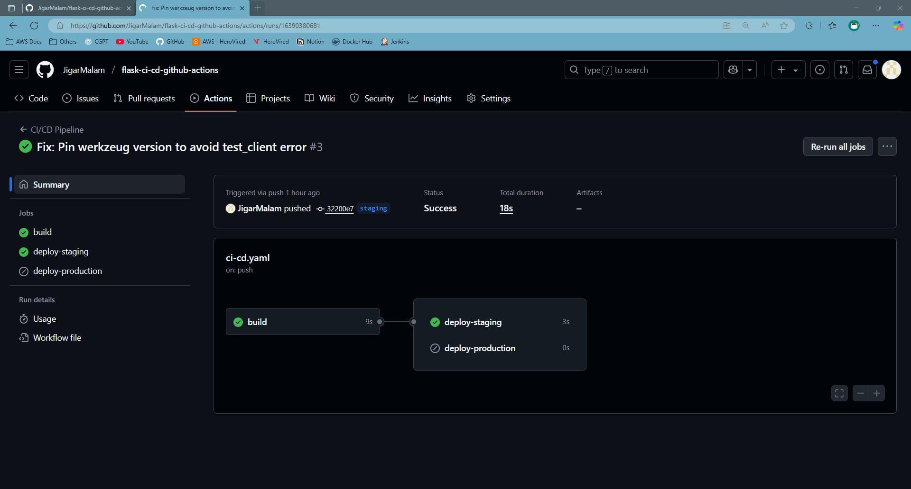
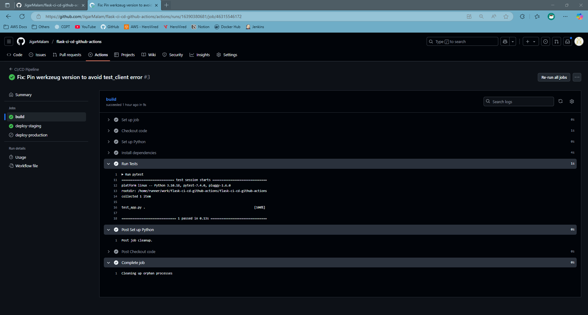
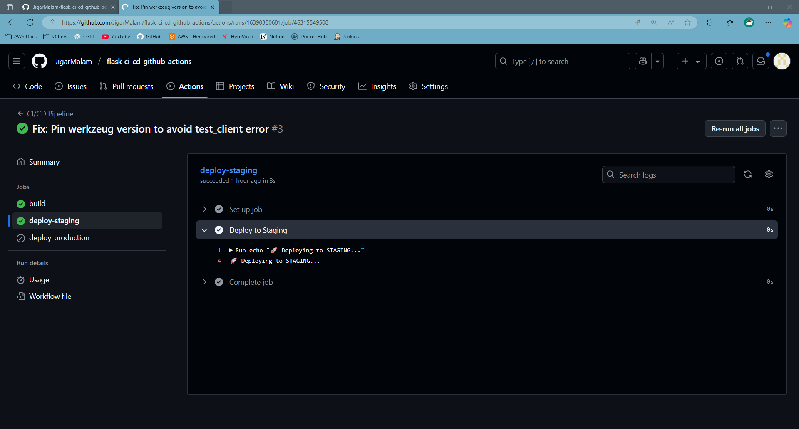
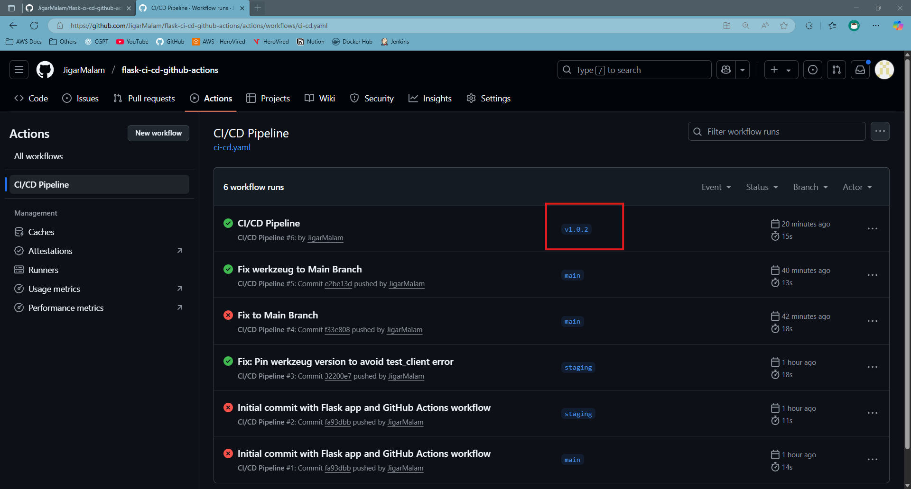
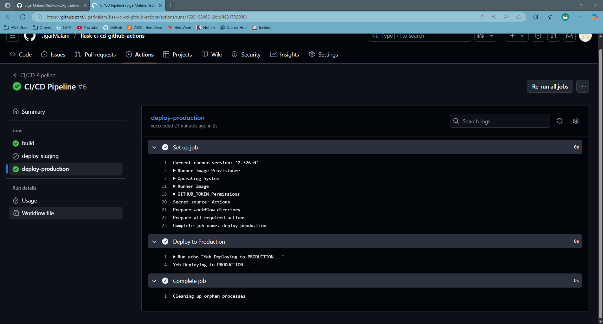

#  Flask GitHub Actions CI/CD Project

This project demonstrates a **CI/CD pipeline using GitHub Actions** for a simple Python Flask application.

---

##  Project Overview

- ✅ Simple Flask web app (`app.py`)
- ✅ One test case (`test_app.py`)
- ✅ GitHub Actions workflow in `.github/workflows/ci-cd.yaml`
- ✅ Automatic testing & deployment simulation
- ✅ Uses `main` and `staging` branches

---

## 🎯 Use Case

> Automate the development workflow for a Python Flask web app with:

- Code validation via unit tests (`pytest`)
- Auto deployment to a staging environment
- Tag-based versioned deployment
- Seamless integration using GitHub Actions

---

##  CI/CD Pipeline Flow (Text-Based Diagram)

```plaintext

         ┌────────────────────┐
         │   Developer Push   │
         └────────┬───────────┘
                  │
         ┌────────▼────────┐
         │ GitHub Actions  │
         └────────┬────────┘
                  │
      ┌───────────▼─────────────┐
      │ Run Build & Unit Tests  │
      └───────────┬─────────────┘
                  │
      ┌───────────▼─────────────┐
      │    On 'staging' push    │
      │  → Deploy to Staging    │
      └───────────┬─────────────┘
                  │
      ┌───────────▼─────────────┐
      │    On 'main' push       │
      │  → Deploy to Production │
      └─────────────────────────┘
```
## Setup Steps
1. **Create and Clone the Repository**
2. **Create a Branch**
   ```bash
   git checkout -b staging
   ```
3. **Push to Remote**
   ```bash
   git push origin staging
   ```

4. **Install Dependencies (Optional for Local Testing)**
   ```bash
   pip install -r requirements.txt
   ```

5. **Run Locally (Optional)**
   ```bash
   python app/app.py
   ```
6. **Trigger GitHub Actions**
   
   - Trigger GitHub Actions
   - Or create a tag like v1.0.1 to trigger a release build


## ScreenShots

| Description                      | Screenshot                  |
|-----------------------------------|-----------------------------|
| Main branch push                  |          |
| Staging branch push               |       |
| Tests passed                      |    |
| Deploy to staging output          | |
| Tag triggered deploy to production|   |
| Full success pipeline summary     |          |

